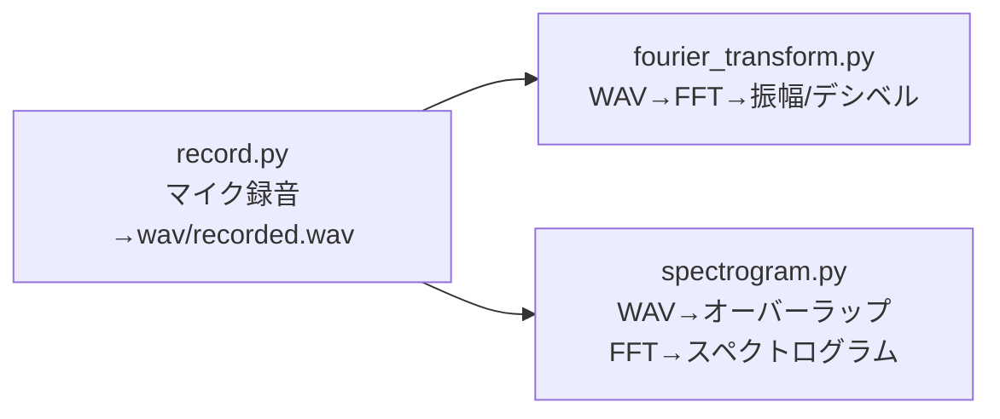

This repository consists of sample code and presentation slides prepared for PyCon JP 2025.
I prepared this for those who listened to the talk on the day, and for those who couldn't hear the talk but would like to read the materials and try out the code.

# 音声録音→フーリエ変換→スペクトログラム 可視化ガイド

このドキュメントは、`record.py`（録音とWAV保存）、`fourier_transform.py`（フーリエ変換とスペクトル表示）、`spectrogram.py`（短時間フーリエ変換ベースのスペクトログラム表示）の**関係**と**使い方**を一枚で把握できるようにまとめたものです。



---

## 0. セットアップ

### 依存ライブラリ
- Python 3.x
- `pyaudio`, `soundfile` (`pysoundfile`), `numpy`, `matplotlib`, `scipy`

```bash
pip install pyaudio soundfile numpy matplotlib scipy
```

> **フォルダ構成（例）**
> ```text
> project_root/
> ├─ record.py
> ├─ fourier_transform.py
> ├─ spectrogram.py
> └─ wav/              # record.py 実行後に自動作成 & recorded.wav を保存
> ```

---

## 1) `record.py` — マイクから録音して `wav/recorded.wav` を作る

### 役割
- PyAudioで**単一チャンネル/16bit**録音を行い、**正規化済みのfloat波形**（-1〜1相当）として配列を返す。
- 最後に `wav/recorded.wav` を作成（フォルダが無ければ自動作成）。
- 併せて**時間波形プロット**を表示。

### 主要パラメータ（`__main__`）
- `time` … 録音時間 [s]（例：5）  
- `samplerate` … サンプリング周波数 [Hz]（例：44100）  
- `fs` … **フレームサイズ**（内部読み出し単位、例：1024）  
- `index` … **入力デバイス番号**（環境により異なる）  

### デバイス番号の調べ方（任意）
```python
import pyaudio
pa = pyaudio.PyAudio()
for i in range(pa.get_device_count()):
    info = pa.get_device_info_by_index(i)
    print(i, info.get("name"), "in_ch:", info.get("maxInputChannels"))
pa.terminate()
```

### 実行
```bash
python record.py
```
実行後、`wav/recorded.wav` が作成されます。

> **メモ**: ステレオ入力でも内部で**モノラル録音**を行っています（`channels=1`）。

---

## 2) `fourier_transform.py` — WAV を読み込んで**フーリエ変換**

### 役割
- `wav/recorded.wav` を読み込み、実数FFT（`np.fft.rfft`）で**片側振幅スペクトル**を計算し、**デシベル表示**でプロット。  
- デシベル変換は `amp_db = 20 * log10(amp / 2e-5)` を使用（2e-5は空気音圧 20 μPa を参照値とする**SPLの慣習**）。

> ⚠️ **注意（SPLの厳密性）**  
> 録音値は**無次元の正規化波形**であり、実際のパスカル値ではありません。よって上記dBは**相対値**です。絶対SPLに合わせたい場合は、校正音（例：1 kHz, 94 dB）でスケール係数を求めてください。

### 数式メモ
- サンプル点数を \(N\)、サンプリング周期を \(dt\) とすると、解析時間 \(T = N \cdot dt\)。  
- **周波数分解能** \( \Delta f \approx \frac{1}{T} = \frac{1}{N\,dt} = \frac{f_s}{N} \)。

### 実行
```bash
python fourier_transform.py
```

> **表示のコツ**: コードでは `xlim=[0, 5000]` で**5 kHzまで**に拡大しています。音声の基本帯域を見やすくする意図です（必要に応じて変更）。

---

## 3) `spectrogram.py` — WAV を**時間周波数表示**（スペクトログラム）

### 処理の流れ
1. WAV読込（ステレオなら**平均でモノラル化**）  
2. `Fs`（フレームサイズ）と`overlap`（%）でオーバーラップ分割  
3. 各フレームに**ハニング窓**適用（`acf`で**振幅補正**）  
4. 各フレームをFFT → **縦: 周波数 / 横: 時間** になるよう転置  
5. `20*log10(·/2e-5)` で**dB変換**し `imshow` で可視化

### 主要パラメータ
- `Fs` … **フレームサイズ**（例：2048） → おおよそ **周波数分解能** \( \Delta f \approx \frac{f_s}{Fs} \)  
- `overlap` … **オーバーラップ率[%]**（例：90） → **時間分解能**は**ホップ長** \( H = Fs \cdot (1-\frac{\text{overlap}}{100}) \) に依存。時間分解能（フレーム間隔） \( \Delta t \approx \frac{H}{f_s} \)。

> **フレーム数の概算**  
> 信号長を \(T\) [s] とすると、おおよそ  
> \[ N_\text{frames} \approx \left\lfloor \frac{T - \frac{Fs}{f_s} \cdot \frac{\text{overlap}}{100}}{\frac{Fs}{f_s} \cdot \left(1-\frac{\text{overlap}}{100}\right)} \right\rfloor \]
> （コードの `ov()` と同等の考え方）

### よく使う設定例
- 音声（話者）: `Fs=1024〜2048`, `overlap=75〜90%`  
- 楽器（倍音細かく）: `Fs=2048〜4096`, `overlap=85〜95%`

### 実行
```bash
python spectrogram.py
```

> **表示レンジ**: コードでは `vmin=0, vmax=60`（dB相対）や `ylim=[0, 5000]` を設定。見やすさに応じて調整してください。

---

## 4. 典型的なワークフロー（まとめ）

1. **録音する**  
   ```bash
   python record.py
   ```
   → `wav/recorded.wav` が生成

2. **周波数特性をざっくり見る（1枚のスペクトル）**  
   ```bash
   python fourier_transform.py
   ```

3. **時間と周波数の変化を見る（スペクトログラム）**  
   ```bash
   python spectrogram.py
   ```

---

## 5. トラブルシューティング

- **無音/レベルが極端に小さい**: マイクミュート、デバイス`index`違い、環境音が小さい等を確認。  
- **`Input overflowed`**: 入力負荷やフレームサイズが小さすぎる場合に発生。`fs`（record.py）をやや大きく。  
- **dB計算で `-inf` が出る**: 0が含まれると `log10(0)` で発生。`np.maximum(x, 1e-12)` のように**下限をクリップ**してからdB化すると安定。  
- **WindowsでPyAudioが入らない**: 事前に「PortAudio同梱のPyAudio wheel」を用いるか、`pip install pipwin && pipwin install pyaudio` を検討。

---

## 6. 補足の数式（目安）

- **FFT（1フレーム）の分解能**:  
  \( \Delta f \approx \frac{f_s}{N} \)（ここで \(N=Fs\) ）
- **STFTの時間分解能（フレーム間隔）**:  
  \( \Delta t \approx \frac{H}{f_s} = \frac{Fs\,(1-\text{overlap}/100)}{f_s} \)

> **窓補正（`acf`）**: ハニング窓で平均振幅が減衰するため、\(\text{acf} = 1 / (\text{mean}(w))\) を掛けて**振幅の目安**を保っています。

---

## 7. より良い可視化・解析のヒント

- **帯域ズーム**: 人声なら 0–5 kHz、楽器なら 0–10 kHz に設定すると見やすい。  
- **カラーマップ**: `jet` 以外に `magma`, `viridis` なども視認性が高い（※要変更）。  
- **保存**: `plt.savefig()` を追加して図をファイル保存すると資料化がスムーズ。

---

### 参考：各スクリプトの入出力まとめ

| スクリプト | 入力 | 出力 | 可視化 |
|---|---|---|---|
| `record.py` | マイク入力（`index`/`samplerate`/`fs`/`time`） | `wav/recorded.wav` | 時間波形 |
| `fourier_transform.py` | `wav/recorded.wav` | 周波数&振幅（dB相対） | 振幅スペクトル |
| `spectrogram.py` | `wav/recorded.wav` | 2D 時間–周波数（dB相対） | スペクトログラム |

---

必要に応じて、`index` や `Fs`、`overlap` を調整して目的の時間/周波数解像度にチューニングしてください。これで**録音→一括FFT→時間周波数**の一連の解析が最短で回せます。
